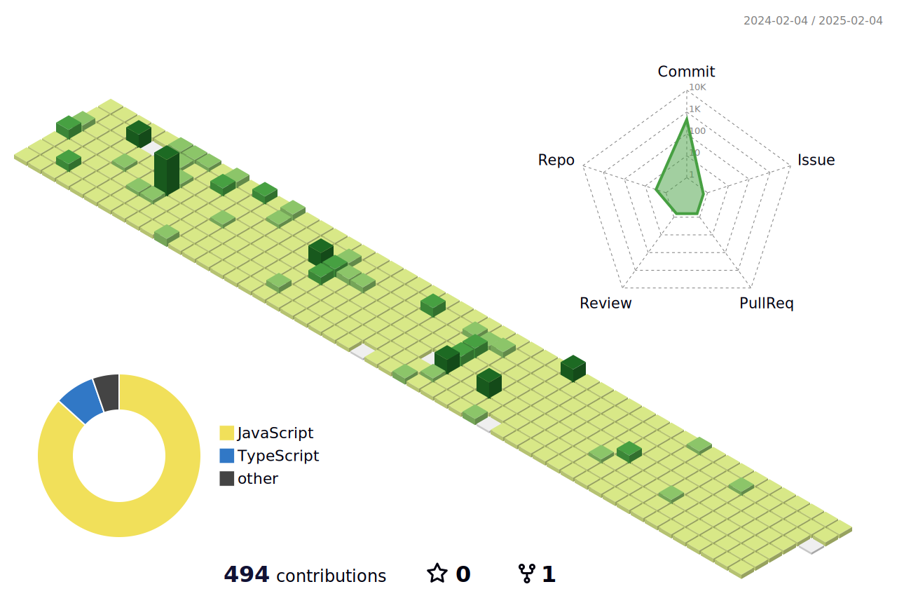

## Hi, 👋 I'm Wade

- 🌱 目前正在学习 `Vue3` 、 `Vite` 和 `TypeScript`
- 📫 联系方式: 295645351@qq.com

### Languaues and Tools

<span > 
   
   
   
   
   
   
   
   
   
    
</span>


### My GitHub Stats

<div align="left">
   
  
</div>

### My Activities

<!--START_SECTION:waka-->

```txt
From: 21 October 2024 - To: 21 October 2025

Total Time: 790 hrs 53 mins

Vue.js                     347 hrs 37 mins ███████████░░░░░░░░░░░░░░   43.95 %
TypeScript                 264 hrs 13 mins ████████▒░░░░░░░░░░░░░░░░   33.41 %
JavaScript                 98 hrs 12 mins  ███░░░░░░░░░░░░░░░░░░░░░░   12.42 %
JSON                       38 hrs 10 mins  █▒░░░░░░░░░░░░░░░░░░░░░░░   04.83 %
Markdown                   12 hrs 35 mins  ▒░░░░░░░░░░░░░░░░░░░░░░░░   01.59 %
Other                      12 hrs 31 mins  ▒░░░░░░░░░░░░░░░░░░░░░░░░   01.58 %
```

<!--END_SECTION:waka-->

### My GitHub Contributions


